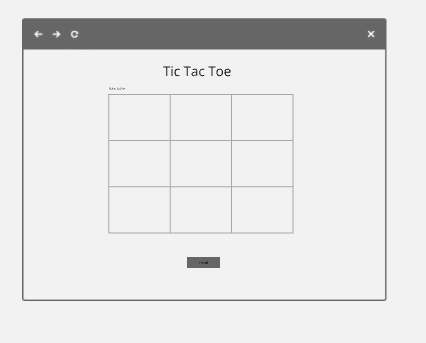
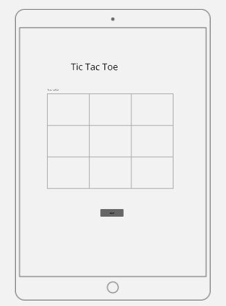

### Project Title
Tic Tac Toe Game
Tic Tac Toe, also known as Noughts and Crosses, is a simple and classic two-player game that has several key features:

## Features 
1. Game Board:
Grid Layout: The game is played on a 3x3 grid, making up 9 squares in total.
Cell States: Each square in the grid can be in one of three states: empty, marked with an "X," or marked with an "O."
2. Players:
Two Players: The game is played between two players. One player uses "X" and the other uses "O."
Turn-Based: Players take turns placing their mark in an empty square on the grid.
3. Objective:
Winning Condition: The goal is to be the first player to get three of their marks in a row. This can be achieved horizontally, vertically, or diagonally.
Draw Condition: If all 9 squares are filled and neither player has three in a row, the game ends in a draw.
4. Gameplay:
Simple Controls: The game is easy to control, usually involving simple clicks or taps to place a mark in the desired square.
Immediate Feedback: The game provides immediate feedback on each move, updating the board with the player's mark and checking for a win or draw.
5. Game Flow:
Starting Player: Typically, one player is randomly chosen to start, or the players can decide who goes first.
Alternating Turns: Players alternate turns until the game ends.
Restart Option: After a game ends, players can reset the board to play again.
6. Winning and Draw Scenarios:
Three in a Row: A player wins if they can align three of their marks in a row (horizontal, vertical, or diagonal).
Draw: If the board is full and no player has three marks in a row, the game ends in a draw.

## Wire Frames
Browser page view

Tablet page view

Mobile page view

## User Stories

-As a Player, I want to see a clear and simple game board, so that I can easily understand and interact with the game.

-As a Player, I want to receive a message when the game ends, whether by a win, loss, or draw, so that I am aware of the final result.

-As a Player, I want to start a new game, so that I can play Tic-Tac-Toe from the beginning.

-As a Player, I want to click or tap on a cell to make my move, so that I can play my turn.

## Future Features 

-I wanted to add game draw message content.

## Validator Testing 

For HTML validation https://validator.w3.org/

For CSS validation  https://jigsaw.w3.org/css-validator/

## Deployment

Site successfully deployed on https://simmi-k.github.io/Tic-tac-toe/

## Credits 

<a href="https://www.youtube.com/results?search_query=tic+tac+toe+tutorial+for+html+css+and+javascript">Online Javascript Tutorials</a>

<a href="https://miro.com/app/board/uXjVKpSyi4A=/">Basic Wireframes for game</a>